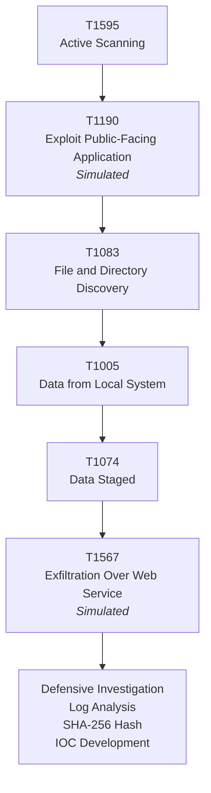

# MITRE ATT&CK Mapping

```mermaid
flowchart TD

A[T1595<br>Active Scanning]
B[T1190<br>Exploit Public-Facing Application<br><i>Simulated</i>]
C[T1083<br>File and Directory Discovery]
D[T1005<br>Data from Local System]
E[T1074<br>Data Staged]
F[T1567<br>Exfiltration Over Web Service<br><i>Simulated</i>]
G[Defensive Investigation<br>Log Analysis<br>SHA-256 Hash<br>IOC Development]

A --> B
B --> C
C --> D
D --> E
E --> F
F --> G
```
